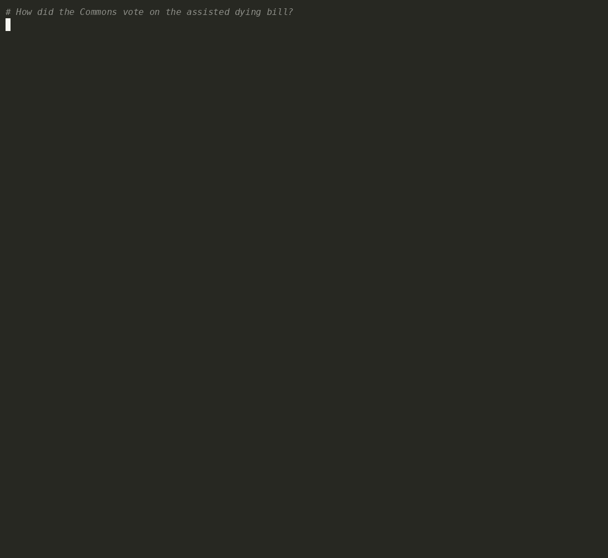

<p align="center">
  
  
  
</p>

<h1 align="center">🇬🇧 UK Parliament AI Assistant</h1>

<p align="center">
  <strong>Turn any MCP-capable AI into a live parliamentary research desk.</strong><br>
  Ask about MPs, Lords, bills, votes, committees, Hansard, and more — answers come from official Parliament APIs, with sources cited every time.
</p>

<p align="center">
  <a href="#-quick-start">Quick start</a> ·
  <a href="#-what-you-can-ask">What you can ask</a> ·
  <a href="#-setup">Setup</a> ·
  <a href="#-example-prompts">Example prompts</a> ·
  <a href="#-active-development-moved">Successor project</a>
</p>

---

> [!IMPORTANT]
> **Active development has moved.** This repository is the original **.NET MCP lab**.  
> The maintained project — with a full **CLI**, richer tooling, and ongoing fixes — is:  
> **👉 [ChrisBrooksbank/uk-parliament-data-mcp](https://github.com/ChrisBrooksbank/uk-parliament-data-mcp)**

| Capability | This repo (legacy lab) | [Successor project](https://github.com/ChrisBrooksbank/uk-parliament-data-mcp) |
|---|---|---|
| MCP server for AI assistants | ✅ .NET | ✅ Python (actively maintained) |
| Command-line interface (CLI) | ❌ **Not here** | ✅ **Yes — CLI is only on the new repo** |
| AIS / zero-install options | Limited | ✅ Expanded |
| Ongoing enhancements & fixes | Archived / low activity | ✅ Active |

If you want the best experience today (especially terminal workflows), start on the [successor repository](https://github.com/ChrisBrooksbank/uk-parliament-data-mcp).

---

## 🎬 See it in action

### MCP in an AI assistant

> **Note:** Claude Code and MCP servers are not authorised for use on parliamentary PCs. This demo was recorded on a non-parliamentary PC.

Ask natural-language questions; the assistant calls Parliament APIs through MCP and returns cited answers.  

<p align="center">
  
</p>

<p align="center"><em>MCP session — live tools, live data, source URLs included.</em></p>

### CLI on the successor project

Prefer the terminal? The **CLI is only available on the new repo** — not in this lab.

<p align="center">
  
</p>

<p align="center"><em>CLI demo from <a href="https://github.com/ChrisBrooksbank/uk-parliament-data-mcp">uk-parliament-data-mcp</a> — install and run it there.</em></p>

---

## ✨ Why this exists

Parliamentary data is public — but scattered across many APIs. This project wraps those endpoints as **MCP tools** so assistants like **GitHub Copilot**, **Claude Desktop**, and other MCP clients can:

| Benefit | What it means |
|--------|----------------|
| 🎯 **Grounded answers** | Responses are fetched from official `parliament.uk` APIs, not model memory alone |
| 🔗 **Source transparency** | Every useful answer can list the API URLs used |
| ⚡ **Broad coverage** | Members, bills, votes, committees, Hansard, questions, calendar, SIs, treaties, interests… |
| 🧩 **Works where MCP works** | VS Code Copilot Chat (Agent mode), Claude Desktop, and other MCP hosts |

> **Disclaimer:** Unofficial, independent project. Not created, endorsed, or supported by UK Parliament. Data comes from public [Parliament developer APIs](https://developer.parliament.uk/).

---

## 🚀 Quick start

### 1. Prerequisites

- [.NET SDK 9+](https://dotnet.microsoft.com/download)
- [Git](https://git-scm.com/downloads)
- An MCP host: [VS Code](https://code.visualstudio.com/) (Copilot Chat) and/or [Claude Desktop](https://claude.ai/download)

### 2. Clone

```bash
git clone https://github.com/chrisbrooksbank-parliament/opendata-mcp-lab.git
cd opendata-mcp-lab
```

### 3. Point your MCP host at the server

**VS Code** — Command Palette → `MCP: Add Server` → **Command (stdio)**:

```bash
dotnet run --project C:\code\opendata-mcp-lab\OpenData.Mcp.Server\OpenData.Mcp.Server.csproj
```

(Adjust the path to your clone.)

**Claude Desktop** — edit `claude_desktop_config.json` (UTF-8), then fully restart Claude:

```json
{
  "mcpServers": {
    "opendata-server": {
      "command": "dotnet",
      "args": [
        "run",
        "--project",
        "C:\\code\\opendata-mcp-lab\\OpenData.Mcp.Server\\OpenData.Mcp.Server.csproj"
      ]
    }
  }
}
```

### 4. Start a session the right way

For best results, **always** begin with the session prompt (or say **"Hello Parliament"**).

<details>
<summary><strong>📋 Required system prompt (click to expand)</strong></summary>

```plaintext
You are a helpful assistant that answers questions using only data from UK Parliament MCP servers.

When the session begins, introduce yourself with a brief message such as:

"Hello! I’m a parliamentary data assistant. I can help answer questions using official data from the UK Parliament MCP APIs. Just ask me something, and I’ll fetch what I can — and I’ll always show you which sources I used."

When responding to user queries, you must:

Only retrieve and use data from the MCP API endpoints this server provides.

Avoid using any external sources or inferred knowledge.

After every response, append a list of all MCP API URLs used to generate the answer.

If no relevant data is available via the MCP API, state that clearly and do not attempt to fabricate a response.

Convert raw data into human-readable summaries while preserving accuracy, but always list the raw URLs used.
```

</details>

To disconnect while keeping chat context: **"Goodbye Parliament"**. Or simply start a new chat.

**Try:**

```plaintext
What is happening now in the House of Commons?
```

---

## 🗺 What you can ask

| Area | Example questions |
|------|-------------------|
| 🔴 **Live activity** | What's happening in the Commons right now? What's on in the Lords? |
| 👥 **Members** | Who is the MP for …? Interests, biography, voting record, contributions |
| 📜 **Bills & legislation** | Details, stages, amendments, publications, news for a bill |
| 🗳 **Votes & divisions** | Commons/Lords divisions by topic, member, or division ID |
| 🏛 **Committees** | Membership, meetings, written/oral evidence, publications |
| 📖 **Hansard & procedure** | Debates, Erskine May, oral questions, calendar / non-sitting days |
| 📍 **Constituencies** | Search seats, election results |
| 📄 **Official docs** | Statutory instruments, treaties, Acts |
| 💎 **Transparency** | Registers of interests and categories |

---

## 🛠 Setup

### VS Code + Copilot Chat

1. `Ctrl+Shift+P` → **MCP: Add Server** → **Command: Stdio**
2. Enter the `dotnet run --project …` command above
3. **MCP: List Servers** → start the server
4. Open **Copilot Chat** → **Agent** mode → enable this server’s tools
5. Paste the system prompt (or **Hello Parliament**), then ask a question
6. Approve tool/permission prompts when asked

### Claude Desktop

1. **Settings → Developer → Edit Config**
2. Add the `mcpServers` block shown in Quick start
3. Save as **UTF-8**, quit Claude completely, relaunch
4. Confirm the server is running under Developer, then test with the system prompt

### Optional: repo `.mcp.json`

This clone includes a sample `.mcp.json` pointing at a built server binary. Prefer `dotnet run --project …` unless you have already built `OpenData.Mcp.Server`.

---

## 💡 Prompting tips

| Tip | Why it helps |
|-----|----------------|
| ✅ Start with the **system prompt** / **Hello Parliament** | Keeps answers on MCP data and forces source URLs |
| 🆕 New chat (`+`) when stuck | Clears loops and stale context |
| 🔗 “Show me the API URL you just used.” | Re-surfaces citations for verification |
| 🧠 Cross-house questions | e.g. “Has Chelmsford been mentioned in Commons or Lords?” |
| 🧾 “Show me the JSON from the last MCP call.” | Debug raw payloads |

Example citation style you should expect:

> `https://members-api.parliament.uk/api/Members/Search?Name=…`

---

## 💬 Example prompts

### Live activity
- What is happening now in both Houses?
- What's currently happening in the House of Commons / Lords?

### Members
- Show me the interests of Sir Keir Starmer  
- Who is Boris Johnson? / Who is member 1471?  
- Biography, contacts, interests, contributions, voting record for a member ID  
- Portrait / thumbnail for member 172  

### Bills
- Recent bills about fishing / environment  
- Details, stages, amendments, publications, news for bill 425  
- Bill types, stages catalogue, RSS feeds  

### Votes
- Search Commons divisions for “refugee” / “climate” / “brexit”  
- Commons or Lords division by ID; results grouped by party  

### Committees
- Committees on women's issues / healthcare  
- Meetings, members, written & oral evidence for a committee ID  

### Procedure, Hansard, calendar
- Search Erskine May for the Mace  
- Oral question times; Hansard on a topic and date range  
- Parties, departments, answering bodies  
- Commons calendar; non-sitting days  

### Places, docs, transparency
- Constituencies containing “london”; election results for a constituency ID  
- SIs about harbours; Acts mentioning roads; treaties involving Spain  
- Interest categories and published registers  

### Power-user
- Show the full data from this pasted API result: `{…}`  
- Show JSON / API URL from the last MCP call  
- Bills sponsored by member 172 from the Environment department  
- Committee meetings on climate change between two dates  

---

## 🏗 What's in this repository

```text
opendata-mcp-lab/
├── OpenData.Mcp.Server/     # .NET MCP server (stdio tools)
│   ├── Tools/               # Members, Bills, Votes, Hansard, …
│   └── Context/             # API shape notes for tools
├── context/                 # Shared API context for LLMs
├── mcp-demo.gif             # MCP assistant demo
├── cli-demo.gif             # CLI demo (successor project only)
└── README.md
```

**Stack:** .NET 9 · MCP stdio transport · official Parliament HTTP APIs  

**Not included here:** the full **CLI**, PyPI packaging, and newer host integrations — those ship only in  
**[uk-parliament-data-mcp](https://github.com/ChrisBrooksbank/uk-parliament-data-mcp)**.

---

## 📌 Active development moved

| | |
|---|---|
| **This repo** | Historical .NET lab / reference MCP server |
| **Go here for new work** | [github.com/ChrisBrooksbank/uk-parliament-data-mcp](https://github.com/ChrisBrooksbank/uk-parliament-data-mcp) |
| **CLI** | **Only on the successor repo** |
| **Package** | [PyPI: `uk-parliament-mcp`](https://pypi.org/project/uk-parliament-mcp/) (successor) |

Issues and PRs against this lab may still be useful for .NET-specific notes, but feature momentum is on the new project.

---

## 🤝 Contributing & feedback

Ideas, corrections, and API coverage suggestions are welcome. For the actively maintained line (including CLI), please open issues or PRs on the [successor repository](https://github.com/ChrisBrooksbank/uk-parliament-data-mcp).

---

<p align="center">
  <sub>Built for curiosity, scrutiny, and better parliamentary questions — powered by public open data.</sub>
</p>
